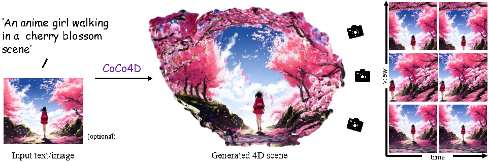

# CoCo4D: Comprehensive and Complex 4D Scene Generation

 

Official implementation for paper 'CoCo4D: Comprehensive and Complex 4D Scene Generation'.

Given a text prompt and an optional reference image as input, we aim at generating both dynamic foreground and background content, which together makes a complex and comprehensive 4D scene.

## Updates and TODOs
- update: initialize the codebase.
- TODO@: code release v1.

## Overview

    

Given a text prompt and an optional reference image, CoCo4D first generates an initial motion sequence utilizing video diffusion models. This motion sequence then guides the synthesis of both the dynamic foreground object and the background using a novel progressive outpainting scheme. To ensure seamless integration of the moving foreground object within the dynamic background, CoCo4D optimizes a parametric trajectory for the foreground, resulting in realistic and coherent blending.

<table class="center" style="width: 75%">
    <tr style="line-height: 2">
      <td width=30% style="border: none; text-align: center">In the background, fireworks bursting. Infront of it, there is a teddy bear dancing slowly within a small area.</td>
      <td width=28% style="border: none; text-align: center">An anime girl walking forward
      in a cherry blossom scene.</td>
    </tr>
    <tr style="line-height: 2">
      <td width=30% style="border: none"></td>
      <td width=28% style="border: none"></td>
    </tr>
 </table>

 ## Quick Start